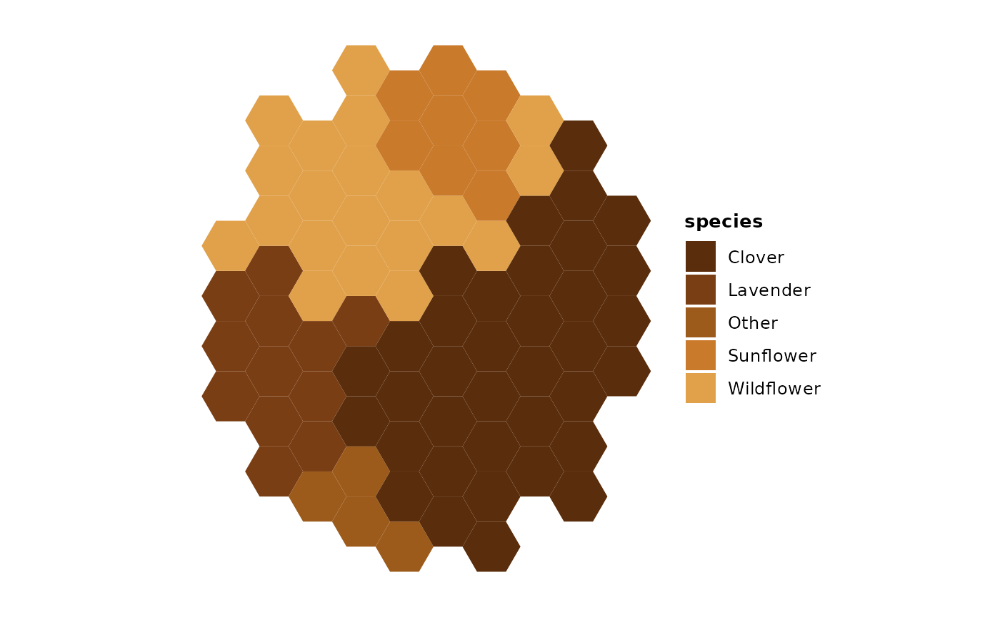
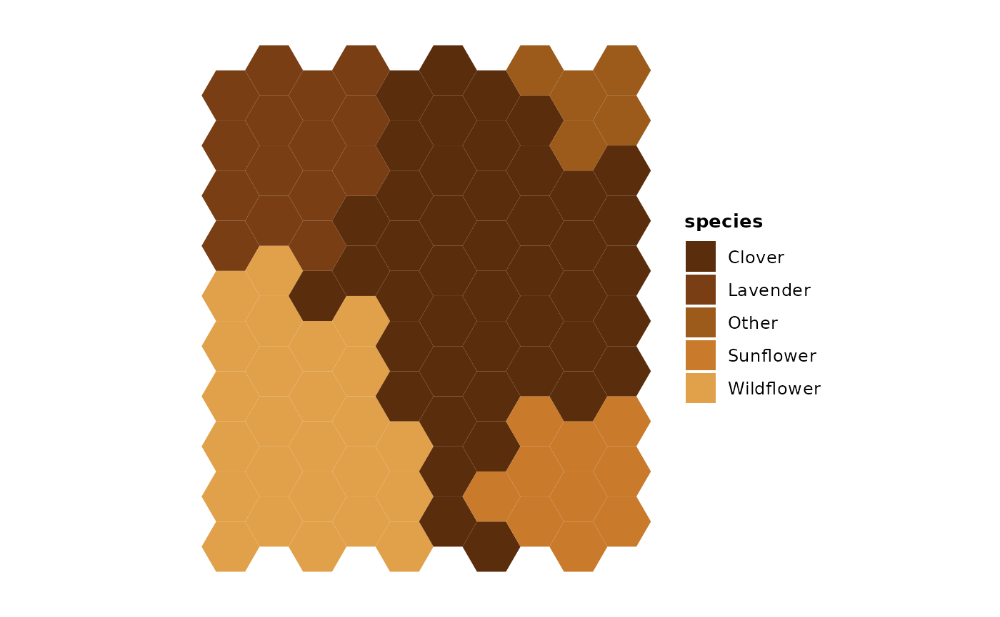
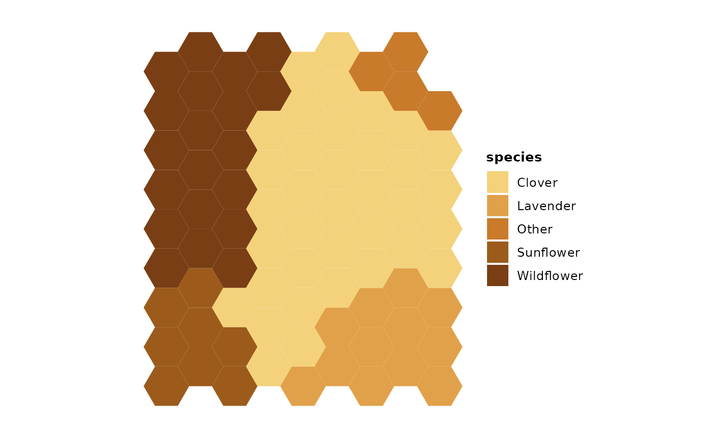
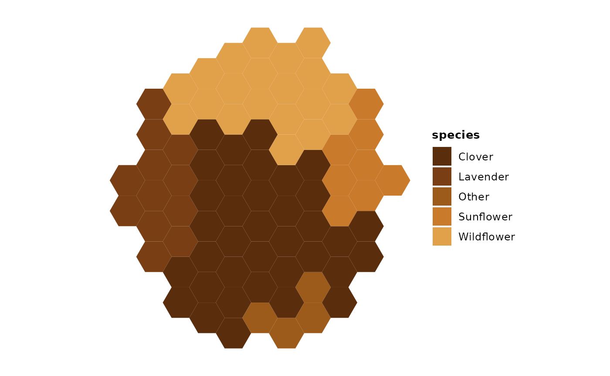
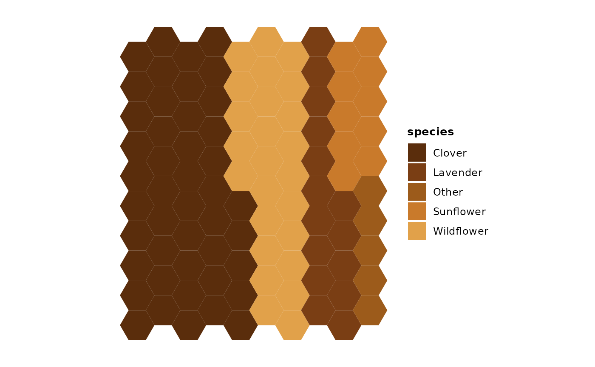
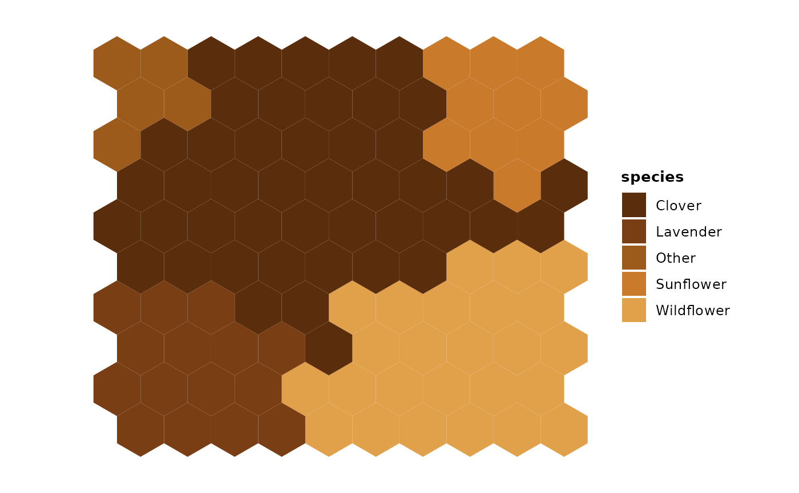
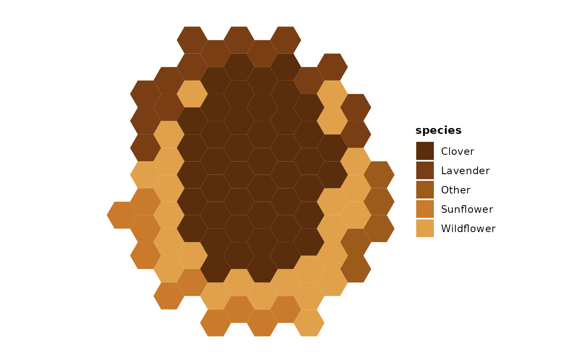

# Getting Started with gghoneycomb

This vignette demonstrates how to create honeycomb plots with
gghoneycomb.

## Example: Pollen composition

The honeycomb layout is useful for showing proportional abundance of
categories. In this example, we visualize the pollen composition of a
honey sample.

``` r
library(ggplot2)
library(gghoneycomb)
```

``` r
pollen <- data.frame(
  species = c("Clover", "Wildflower", "Lavender", "Sunflower", "Other"),
  count = c(45, 25, 15, 10, 5)
)

ggplot(pollen, aes(fill = species, weight = count)) +
  geom_honeycomb(n_cells = 80, silhouette = "rounded", layout = "free", seed = 1) +
  scale_fill_honey() +
  theme_honeycomb() +
  coord_equal()
```



## Choosing the number of cells

If you do not provide `n_cells`, gghoneycomb chooses a value based on
the number of categories and the smallest proportion. As a rule of
thumb, cell counts between 50 and 500 tend to work well for most plots;
higher values increase detail but can make small regions harder to see.

``` r
ggplot(pollen, aes(fill = species, weight = count)) +
  geom_honeycomb(silhouette = "rect") +
  scale_fill_honey() +
  theme_honeycomb() +
  coord_equal()
```



## Using proportions explicitly

If you already have proportions, set `values_are = "proportions"` and
pass the values via the `weight` aesthetic.

``` r
pollen_prop <- data.frame(
  species = c("Clover", "Wildflower", "Lavender", "Sunflower", "Other"),
  prop = c(0.45, 0.25, 0.15, 0.10, 0.05)
)

ggplot(pollen_prop, aes(fill = species, weight = prop)) +
  geom_honeycomb(values_are = "proportions", n_cells = 80, seed = 1) +
  scale_fill_honey(direction = -1) +
  theme_honeycomb() +
  coord_equal()
```



## Controlling the silhouette

The `silhouette` parameter controls the overall shape of the honeycomb:

- `"rect"` (default): a clean rectangular grid.
- `"rounded"`: softened corners for a more organic feel.
- `"organic"`: irregular boundary grown from a central seed.

Pair `silhouette` with `layout = "free"` and `temperature` to fine-tune
the amount of jitter in the layout.

``` r
ggplot(pollen, aes(fill = species, weight = count)) +
  geom_honeycomb(n_cells = 80, silhouette = "organic",
                 layout = "free", temperature = 0.35, seed = 42) +
  scale_fill_honey() +
  theme_honeycomb() +
  coord_equal()
```



## Blocky compact style

`compact_style = "blocky"` carves rectangular blocks instead of
minimizing perimeter. It requires `silhouette = "rect"` and produces a
treemap-like appearance where each category occupies a roughly
rectangular region.

``` r
ggplot(pollen, aes(fill = species, weight = count)) +
  geom_honeycomb(
    n_cells       = 100,
    silhouette    = "rect",
    layout        = "compact",
    compact_style = "blocky"
  ) +
  scale_fill_honey() +
  theme_honeycomb() +
  coord_equal()
```



## Rotation

The `rotation` parameter rotates the rendered honeycomb in 90-degree
increments (0, 90, 180, 270). Rotation is a coordinate transform applied
after allocation, so the category regions and their contiguity are
unchanged. Use it to switch between portrait and landscape orientations.

``` r
ggplot(pollen, aes(fill = species, weight = count)) +
  geom_honeycomb(
    n_cells    = 100,
    silhouette = "rect",
    rotation   = 90,
    seed       = 1
  ) +
  scale_fill_honey() +
  theme_honeycomb() +
  coord_equal()
```



## High temperature

In `layout = "free"` mode, `temperature` controls how loosely the
allocator samples candidate cells. The default is 0.35. Higher values
(e.g., 0.8) widen the frontier and invert scoring preferences, producing
more irregular, less compact category regions. Per-category contiguity
is still guaranteed regardless of temperature.

``` r
ggplot(pollen, aes(fill = species, weight = count)) +
  geom_honeycomb(
    n_cells     = 100,
    silhouette  = "organic",
    layout      = "free",
    temperature = 0.8,
    seed        = 7
  ) +
  scale_fill_honey() +
  theme_honeycomb() +
  coord_equal()
```


